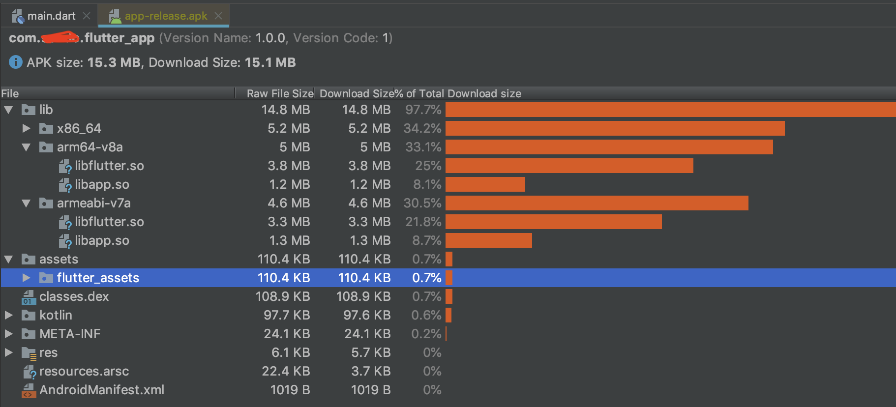
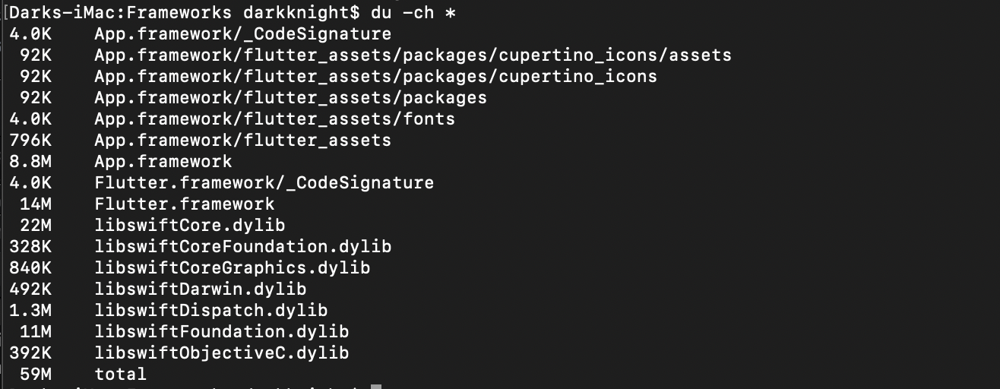

# flutter-appsize-testing-project
I created this project to find a way reducing app size.

How does Flutter contribute to build size?

I used this starter project to analysis the build size of an App that built as Flutter App.

Android

