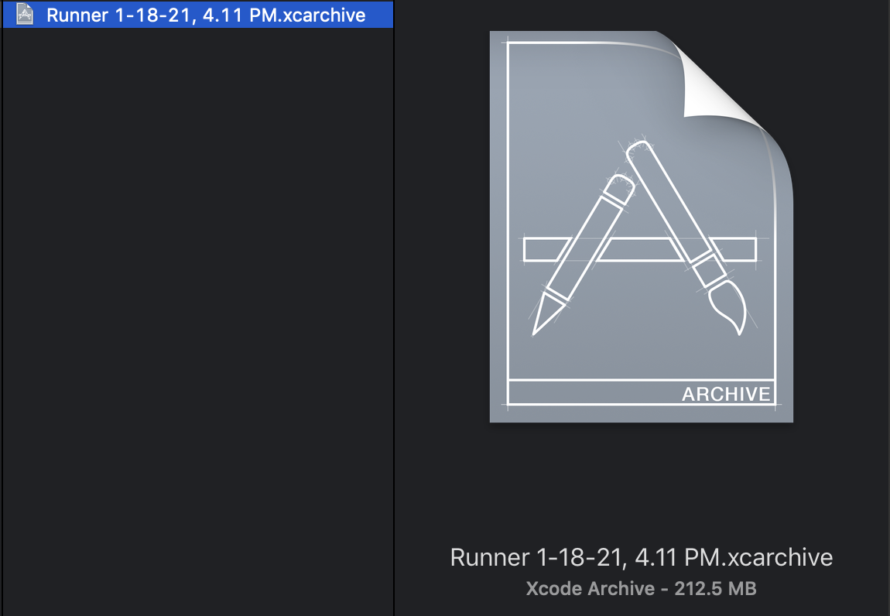
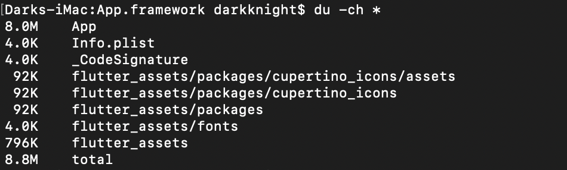

# flutter-appsize-testing-project
I created this project to find a way reducing app size.

How does Flutter contribute to build size?

I used this starter project to analysis the build size of an App that built as Flutter App.

## Android

The biggest space is placed by lib folder with 2 .so files for three architectures:
1. libapp.so
2. libflutter.so

The APK size is 15.3MB for an empty Flutter Starter project. It contains three architectures inside it:
1. x86_64
2. arm64-v8a
3. armeabi-v7a

## iOS

### The iOS archive file size

### The Frameworks Folder.

It includes 2 Flutter frameworks:
1. App.framework (8.8MB)
2. Flutter.framework (14MB)

### More details about App.framework

### More details about Flutter.framework

