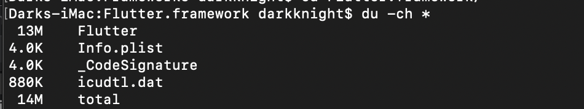

# flutter-appsize-testing-project
I created this project to find a way reducing app size.

How does Flutter contribute to build size?

I used this starter project to analysis the build size of an App that built as Flutter App.

## Android


The biggest space is placed by lib folder with 2 .so files for three architectures:
1. libapp.so
2. libflutter.so

The APK size is 15.3MB for an empty Flutter Starter project. It contains three architectures inside it:
1. x86_64
2. arm64-v8a
3. armeabi-v7a

## iOS

### The iOS archive file size


### The Frameworks Folder.


It includes 2 Flutter frameworks:
1. App.framework (8.8MB)
2. Flutter.framework (14MB)

### More details about App.framework


### More details about Flutter.framework




### Common problems that I meet from do this work.

```
FAILURE: Build failed with an exception.                                
                                                                        
* What went wrong:                                                      
Execution failed for task ':base_webview:verifyReleaseResources'.       
> A failure occurred while executing com.android.build.gradle.internal.tasks.Workers$ActionFacade
   > Android resource linking failed                                    
     /Users/darkknight/.gradle/caches/transforms-2/files-2.1/a528b13ac93e64cafa3d0480e2c93207/core-1.1.0/res/values/values.xml:142:5-173:25: AAPT: error: resource android:attr/fontVariationSettings not found.
                                                                        
     /Users/darkknight/.gradle/caches/transforms-2/files-2.1/a528b13ac93e64cafa3d0480e2c93207/core-1.1.0/res/values/values.xml:142:5-173:25: AAPT: error: resource android:attr/ttcIndex not found.
                                                                        
                                                                        
* Try:                                                                  
Run with --stacktrace option to get the stack trace. Run with --info or --debug option to get more log output. Run with --scan to get full insights.
                                                                        
* Get more help at https://help.gradle.org                              
                                                                        
BUILD FAILED in 35s             
```

This cause by android build tool version is not match. We need to config the build tool version for all sub-projects.

```
subprojects {
    afterEvaluate {project ->
        if (project.hasProperty("android")) {
            android {
                compileSdkVersion 28
                buildToolsVersion '28.0.3'

                compileOptions {
                    sourceCompatibility JavaVersion.VERSION_1_8
                    targetCompatibility JavaVersion.VERSION_1_8
                }
            }

            dependencies {
                implementation 'androidx.appcompat:appcompat:1.0.2'
            }
        }
    }
}
```


